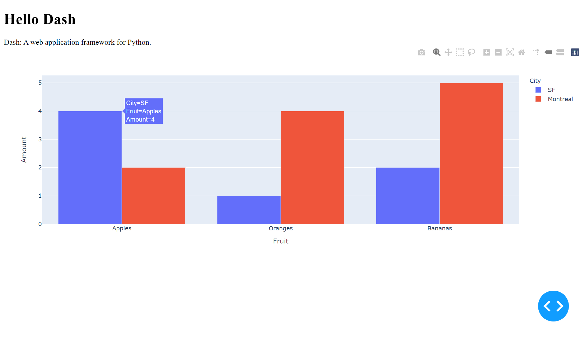

# Learning Plotly Dash
## Table of Contents

1. [Questions](#questions)
2. [Layout](#layout)

## Introduction
In this repo, I share my learning for Plotly Dash which can be used to build ML/AI applications. Important notes are 
documented here as questions with the tutorials files. Dash [tutorial](https://dash.plotly.com/installation) is the 
main reference.

## 1. Questions

### What are the main classes to import in dash? 
1. Build app: `import dash`
2. HTML: `import dash_html_components as html`
3. DCC: `import dash_core_components as dcc`
4. Figures: `import plotly.express as px`
5. Callbacks: `from dash.dependencies import Input, Output`

### What are the main classes in Dash?
- `dash_html_components` for html components.
- `dash_core_components` for ready to use CSS and JS components.
- `plotly.express`: for figures. 
(note: you can also build your own with JS and React.js). 

### What are the main parts/steps of Dash apps?
1. Stylesheet: 
    - `stylesheets = ['link.css'] # CSS`
2. App: 
    - `app = dash.Dash(__name__, external_stylesheets=stylesheet)`
3. DataFrames, dictionaries, and lists: 
    - `df = pd.DataFrame({"key1":[#,#,#], "key2":[#,#,#]})`
    - `colors = {'background': '#111111',
                 'text': '#7FDBFF'}`
    - `options_list = [{'label': 'New York City', 'value': 'NYC'},
                {'label': u'Montreal', 'value': 'MTL'},
                {'label': 'San Francisco', 'value': 'SF'}`
4. Figure: 
    - `fig = px.bar(df, x="x", y="y", ..)`
    - `fig = px.scatter(df, x="x", y="y", size="z", color="n", hover_name="m", log_x=True, size_max=60)`
    - `fig.update_layout(plot_bgcolor=colors['background'],
                  paper_bgcolor=colors['background'],
                  font_color=colors['text']
                  )`
5. Layout: 
    - `app.layout = html.Div(
                        style={'backgroundColor': colors['background']},
                        children=[html.H1('Title'),
                                  html.Div(),
                                  dcc.Graph(),
                                  generate_table(),
                                 ]
                             )` 
    - html components:  
        - `html.Div(children=[] or '''text'', style={})`
        - `html.H1(children=[], style={})`
        - `html.Label('Label')`
        - `html.Br(children=[], style={})`
        - `html.Table([html.Thead(html.Tr()), 
                       html.Tbody(html.Tr()),
                       ])`
        - you can use a function to build these components and call them in `html.Div(generate_table())`.
            - `generate_table():
                 table = html.Table([html.Thead(html.Tr(['list.comprehension'])), 
                                     html.Tbody(html.Tr(['list.comprehension'])),
                                     ])
                 return table` 
    - core components: 
        - `dcc.Graph(id="example-graph", figure=fig)`
        - `dcc.Input(id='my-input', value='', type='text')`
        - `dcc.Markdown(children='''text'')`
        - `dcc.Dropdown(options=options_list, value='MTL', multi=True)`
        - `dcc.RadioItems(options=options_list,value='MTL')`
        - `dcc.Checklist(options=options_list, value=['MTL', 'SF'])`
        - `dcc.Input(value='MTL',type='text')`
        - `dcc.Slider(min=0,max=9,marks={i: 'Label {}'.format(i) if ..}, value=5})`
    - each html component has `style` property as `dict()`: 
        - `'textAlign': 'center'`
        - `'color': colors['text']`
        - `'backgroundColor': colors['background']`
6. Callback:
    - callback components must have a matching id in the layout. 
    - `@app.callback(Output(component_id='my-output', component_property='children'), 
                     Input(component_id='my-input', component_property='value')`
    - `def update_out_div(input_value):
        return 'Output: {}'.format(input_value)`
7. Run:
    - `app.run_server(debug=True)`

### How Dash apps are usually executed?
Python code should be saved in files and executed using a command line: 
    - `python app.py` 

## 2. Layout
### Hello Dash

- File: [`01_HelloDash.py`](01_Layout/01_HelloDash.py)
- Notes: 
    - `children` property is always the first attribute and can be omitted. 
        - `html.H1(children='Hello Dash')` == `html.H1('Hello Dash')`
        - it can contain: a string, a number, a single component, or a list of components. 
        
### Customized Hello Dash
- File: [`02_CustomizedHelloDash.py`](01_Layout/02_CustomizedHelloDash.py)
- Notes: 
    - The style is added as a dictionary to `dash_html_components` 
      (while in html, `style` is a semicolon-separated string). 
    - Keys in `style` are camelCased (e.g. `textAlign` instead of `text_align`). 
    - Html `class` attribute is `className` in Dash.
    
### Pandas Table
- File: [`03_PandasTable`](01_Layout/03_PandasTables.py) 
    
### Bubble Chart
- File: [`04_BubbleChart.py`](01_Layout/04_BubbleChart.py)

### Markdown 
- File: [`05_Markdown.py`](01_Layout/05_Markdown.py)

### Interactive Components 
- File: [`06_Interactive.py`](01_Layout/06_Interactive.py)
- For other components: [dash_core_components](https://dash.plotly.com/dash-core-components) 
- Call help in python: `help(dcc.Dropdown)`.

## 3. Callback
### Basic
- File: [`01_Callback.py`](02_Callback/01_Callback.py) 
- Notes:
    - The "inputs" and "outputs" are described declaratively as the arguments of the @app.callback decorator.
    - About using the `@app.callback` decorator.
        a. This function is called whenever the value of the "input" component (the text box) changes in order 
           to update the children of the "output" component on the page (the HTML div).
        b. You can use any name for the function that is wrapped by the @app.callback decorator.
        c. You can use any name for the function arguments.
        d. You must use the same id you gave a Dash component in the app.layout when referring to it as either an input 
           or output of the @app.callback decorator.
        e. The @app.callback decorator needs to be directly above the callback function declaration. If there is a blank 
           line between the decorator and the function definition, the callback registration will not be successful.
    - Whenever an input property changes, the function that the callback decorator wraps will get called automatically.
    - The component_id and component_property keywords are optional (not necessary!). 
    - Don't confuse the dash.dependencies.Input object and the dash_core_components.Input object. 
      The former is just used in these callbacks and the latter is an actual component.
    - Notice that no value was set for the children property of the `my-output` component in the layout. When the Dash 
      app starts, it automatically calls all of the callbacks with the initial values of the input components in order 
      to populate the initial state of the output components. In this example, if you specified something like 
      `html.Div(id='my-output', children='Hello world')`, it would get overwritten when the app starts.